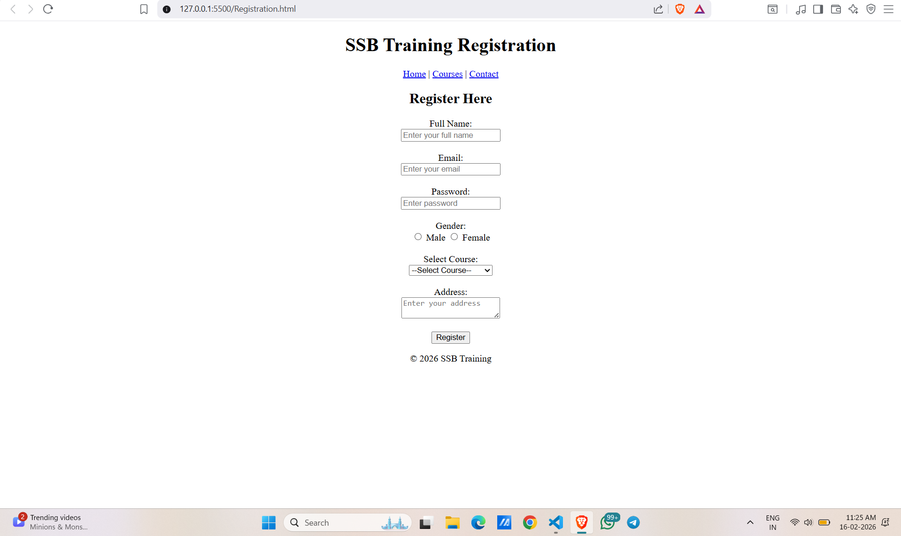

# Day -2 Semantic HTML & Forms
# 1️⃣🔹 What is Semantic HTML?

-Semantic HTML means using meaningful tags that describe the purpose of the content.

-Instead of using only 
 we use proper structure tags.

# 🔹 Important Semantic Tags #
| Tag         | Purpose                        |
| ----------- | ------------------------------ |
| `<header>`  | Top part of page (logo, title) |
| `<nav>`     | Navigation links               |
| `<main>`    | Main content area              |
| `<section>` | A section of content           |
| `<article>` | Independent content block      |
| `<footer>`  | Bottom part of page            |

# 🧠 Why Semantic HTML is Important?
-✔ Improves SEO

-✔ Easy to understand code

-✔ Better accessibility

-✔ Clean structure

-✔ Professional development standard

# 📝 2️⃣ Forms – THEORY
# 🔹 What is a Form?

-A form collects user input.

# Example:

-Registration form

-Login form

-Contact form

# 🔹 Important Form Tags
| Tag          | Purpose          |
| ------------ | ---------------- |
| `<form>`     | Wraps all inputs |
| `<input>`    | Takes user data  |
| `<textarea>` | Multi-line text  |
| `<select>`   | Dropdown         |
| `<button>`   | Submit button    |

# 🔹 Important Attributes
| Attribute     | Purpose                |
| ------------- | ---------------------- |
| `name`        | Identifies data        |
| `value`       | Default value          |
| `required`    | Makes field compulsory |
| `placeholder` | Shows hint text        |
| `type`        | Defines input type     |

# Example:
<input type="text" name="username" placeholder="Enter Name" required>

# 🚀 3️⃣ Build Registration Form
<!DOCTYPE html>
<html>
<head>
    <title>Registration Form</title>
</head>
<body>

<header align="center">
    <h1>SSB Training Registration</h1>
</header>

<nav align="center">
    <a href="#">Home</a> |
    <a href="#">Courses</a> |
    <a href="#">Contact</a>
</nav>

<main>
    <section>

        
   <!-- Center Starts -->

        <article>
            <h2>Register Here</h2>

            <form>

                <label>Full Name:</label> 
                <input type="text" name="fullname" placeholder="Enter your full name" required>  

                <label>Email:</label> 
                <input type="email" name="email" placeholder="Enter your email" required>  

                <label>Password:</label> 
                <input type="password" name="password" placeholder="Enter password" required>  

                <label>Gender:</label> 
                <input type="radio" name="gender" value="male" required> Male
                <input type="radio" name="gender" value="female"> Female
                  

                <label>Select Course:</label> 
                <select name="course" required>
                    <option value="">--Select Course--</option>
                    <option value="java">Java Full Stack</option>
                    <option value="python">Python with AI & ML</option>
                    <option value="react">React JS</option>
                </select>
                  

                <label>Address:</label> 
                <textarea name="address" placeholder="Enter your address" required></textarea>
                  

                <button type="submit">Register</button>

            </form>
        </article>

        
  <!-- Center Ends -->

    </section>
</main>

<footer align="center">
    
© 2026 SSB Training

</footer>

</body>
</html>

# OUT PUT

